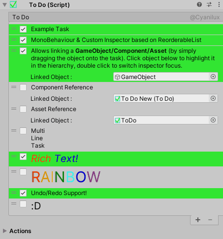

# ToDo
A simple in-editor To-Do list for Unity. 
Tested in Unity 2020.1, 2019.3 and 2018.3. Unsure if it'll work in versions prior to that. 

• Attached as a **Component** on a **GameObject**. Can have as many as you want. 
• Uses a **Custom Inspector** based on **UnityEditorInternal.ReorderableList**. Easily reorganise tasks by dragging the left side of each element 
• Title of ReorderableList can be edited. 
• Each task includes : **Completion Tickbox**, **Text Area**, and the option to link a **GameObject**, **Component** or **Asset** by dragging it onto the task. Cross-scene references are not supported and will be cleared when reloading the scene. Once an object is linked, it can be removed by using the **Object Field** that appears and selecting *None* at the top. 
• Completed tasks turn green. Use the *"Remove Completed Tasks"* button to remove all completed tasks. 
• Supports **Rich Text**, (but is disabled while editing the task, so you can see what you are writing) 
• Has **Undo / Redo** Support. 
• **Export** Tasks to a txt file (object references will be lost though). 
• **Import** Tasks from a txt file. Each line in the file will be added as a task. Lines starting with *"[Complete]"* are marked as completed. 
 
@Cyanilux 
:)
